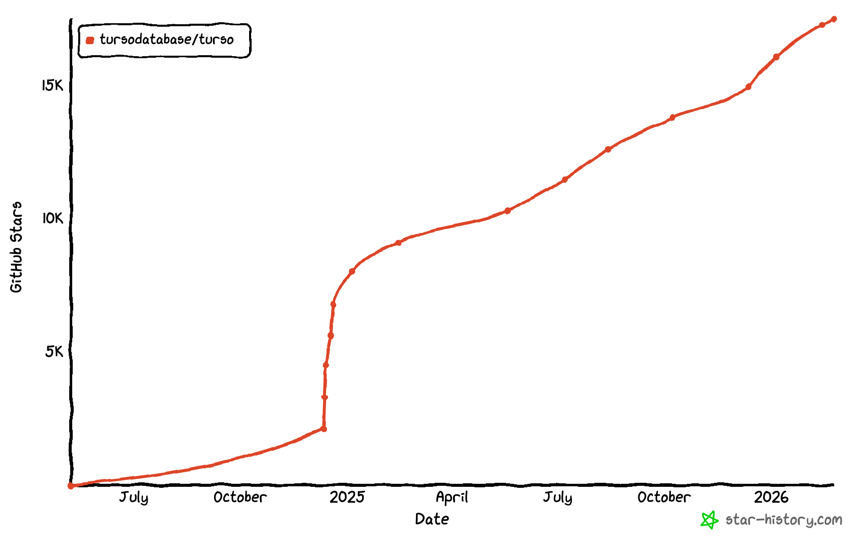
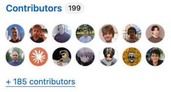

<!-- _class: lead -->

# SQLite: More Powerful Than You Think

Mikaël Francoeur

---

## SQLite

- Embedded database
- A single file, or in-memory
- Library ≈650KB
- Since 2000
- Public domain
- 3 developers
- 1 trillion databases worldwide: browsers, phones, planes, cars, TVs, cameras…

---

<!-- _class: lead -->

## Demo: SQLite

---

## Application-Defined SQL Functions

- Simple functions
- Window functions
- Aggregate functions
- Table-valued functions

---

## Vector Extensions

Local Vector Search

- **sqlite-vec**: 
  - in alpha
  - sponsored by Mozilla, Turso, and others
  - Last release in 2024
- **sqlite-vector**: 
  - led by SQLite AI, highly optimized
  - Last release yesterday

---

## Session Extension

- Open a session
- Modify the database
- Create a changeset file
- Apply the generated file to another database to synchronize it

- Can be reversed (A→A' but also A'→A)
- Changesets can be merged
- Even supports "rebase"

---

## sqlite-http

- by Alex Garcia
- pre-v1
- no observability
- good for rapid prototyping (LLM)

---

## zipfile

Read/modify files inside an archive

Write the rows of a query result into an archive, one file per row

### Use cases:
- Find a class/string in a JAR or docx
- Modify data in zip files in a one-time script
- Transform your query results into an archive

---

## Other Capabilities/Extensions

**Built into SQLite:**
- [SQLite Archive](https://sqlite.org/sqlar.html)
- [Spell Checking](https://sqlite.org/spellfix1.html)

**Extensions:**
- [sqlelf](https://github.com/fzakaria/sqlelf)
- [sqlite-js](https://github.com/sqliteai/sqlite-js)
- [litesql/kafka](https://github.com/litesql/kafka)
- [litesql/nats](https://github.com/litesql/nats)

**Replication Tools**

- [libSQL](https://github.com/tursodatabase/libsql)
- [Litestream](https://litestream.io/)
- [sqlite-sync](https://github.com/sqliteai/sqlite-sync)
- [sqlsync](https://github.com/orbitinghail/sqlsync)
- [sqlite-rsync](https://sqlite.org/rsync.html)

---

## Turso

- SQLite-compatible
- Async-first
- Encryption, Vector Search
- Multi-Writer
- MIT license
- 17K GH stars
- 200 contributors

---

# Comment, Like and Subscribe

---

# Link to the code examples

